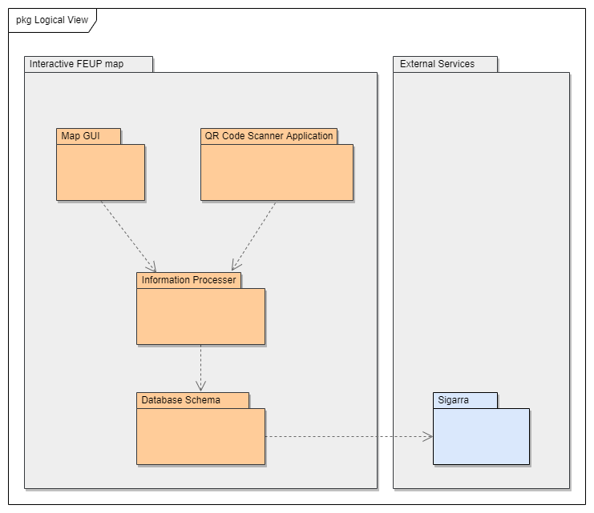

# FEUP ES Project - Interactive FEUP map

_Final Grade:_ 18.9

Welcome to the documentation pages of the _Interactive FEUP Map_

You can find here detailed about the product, from a high-level vision to low-level implementation decisions, a kind of Software Development Report, organized by discipline (as of RUP): 

* [Business modeling](#product-vision)
  * [Product Vision](#product-vision)
  * [Elevator Pitch](#elevator-pitch)
* [Requirements](#requirements)
  * [Use Case Model](#use-case-diagram)
  * [Domain model](#domain-model)
* [Architecture and Design](#architecture-and-design)
  * [Logical architecture](#logical-architecture)
  * [Physical architecture](#physical-architecture)
  * [Vertical prototype](#vertical-prototype)

## 2LEIC02T1 - Members
- Alexandre Costa - up202005319
- Ana Beatriz Fontão - up202003574
- Ana Rita Oliveira - up202004155
- Bárbara Rodrigues - up202007163

## Product Vision
### Vision Statement

For new visitors and all FEUP students who struggle to find key points, the interactive FEUP map is a new feature in the
Uni app that allows the user to find particular places on FEUP's installations easily from the convenience of their phones.
Unlike other available platforms, the interactive FEUP map helps you go through FEUP without missing the good spots.

### Elevator Pitch

The majority of new FEUP students struggle to navigate through the university's facilities. Our feature, the Interactive FEUP Map, was made with those students in mind. Our main goal is to give those students a better and easier experience than ours when we first started our course, by allowing them to explore the university freely and comfortably with our app. 

### Main Features
 - Interactive map - A map that highlights the places and spots chosen by the user.

### Required API's
- Sigarra's maps (FEUP's installations)

## Requirements

### Use Case Diagram

 

  

|||
| --- | --- |
| *Name* | See the entire map |
| *Actor* | Customer | 
| *Description* | The customer can have a look at the map, having the option to choose a specific part to highlight. |
| *Preconditions* | - The costumer has a functional device with a camera.   - The customer has downloaded the uni app. |
| *Postconditions* | - The customer sees the full map or the desired part of the university. |
| *Normal flow* | 1. The customer accesses the app of FEUP’S Interactive Map System.  2. The customer chooses a department available on the selection box.  3. The customer is given three zoom in options. |
| *Alternative flows and exceptions* | 1. The user can’t find their exact location.  2. They should use the option to scan a QR code. |

|||
| --- | --- |
| *Name* | Filter specific spots |
| *Actor* | Customer | 
| *Description* | The Customer takes a look at the map having the option to choose a spot to see in more detail. |
| *Preconditions* | The spot category chosen is defined on the selection box. |
| *Postconditions* | - The customer has a general idea of what are the spots availables in FEUP’s facilities.  - The spot is saved as a favourite spot for later consultation by the customer. |
| *Normal flow* | 1. The customer accesses the app.  2. The customer chooses a category spot that exists in the selection box.  3. The spots that belong to that category are highlighted in the map.  4. The customer can click on a specific spot to see their specifications in more detail. |
| *Alternative flows and exceptions* | 1. [Point of interest not present] If the user can’t find the spot they’re looking for in the given options they should seek help with FEUP’s staff. |

|||
| --- | --- |
| *Name* | Locate yourself inside FEUP’s facilities |
| *Actor* | Customer | 
| *Description* | The customer takes a look at the map in order to know their current position and, if they want, they are able to find the way to the point of interest. |
| *Preconditions* | - The costumer has a functional device with a camera.  - There exists a QR code near the customer’s position. |
| *Postconditions* | - The customer knows where they are inside FEUP’s facilities.  - The customer now has an idea of which spots exist around them. |
| *Normal flow* | 1. The customer accesses the app of FEUP’s Interactive Map System.  2. The costumer scans a QR code near them to indicate to the system their current position.  3. The customer takes a look at the general map and see what is their current position. |
| *Alternative flows and exceptions* | 1. [QR code missing] If, in step 2, the customer doesn’t find any QR code near them, they should walk until one appears. |

### Domain Model

  

## Architecture and Design

### Logical Architecture

Our application is divided into the following packages:
 - *Map UI* -> responsible for showing the maps and allowing the interaction between the user and the functionalities of the maps.
 - *QR Code Scanner Application* -> responsible for managing the QR code scanner and for processing the presented code.
 - *Information processer* -> responsible for recognizing the choices and the location of the user.
 - *Database Schema* -> responsible for storing the maps and all the points of interest.
 - *Sigarra* -> reponsible for providing the maps.

  

### Physical Architecture

The physical architecture of our project is divided in four main parts:
- The user mobile phone.
- An application that allows scanning of QR codes.
- A server to manage the input data from the user and to retrieve the information needed from the database.
- The Sigarra server to provide us the maps of the university and its departments.

We chose Flutter to develop this feature of the Uni application to coincide with the already existing implementation. 
We will also be using a database to store all the information related to departments and points of interest, which means that our feature will use queries in order
to retrieve said information. For this purpose, we will use SQLite due to its simplicity.
In order to use our feature, the user also needs to have the Uni4all application installed on their device. 

  

### Vertical Prototype

During the development of this iteration, to help visualize the decisions we made so far, especially visual, we implemented a small app that implemented the main page of our feature. 

### Project Management

Here you can see how our project backlog evolved.
- Backlog management: [here](https://github.com/LEIC-ES-2021-22/2LEIC02T1/blob/main/Backlog.md)
- Release management: [v0](https://github.com/LEIC-ES-2021-22/2LEIC02T1/releases/tag/Release), [v1](https://github.com/LEIC-ES-2021-22/2LEIC02T1/releases/tag/v1.0.0), [v2](https://github.com/LEIC-ES-2021-22/2LEIC02T1/releases/tag/Release2), [v3](https://github.com/LEIC-ES-2021-22/2LEIC02T1/releases/tag/Release3), [final release](https://github.com/LEIC-ES-2021-22/2LEIC02T1/releases/tag/ReleaseFinal)
- Iteration planning and retrospectives: [Iteration 1](https://github.com/LEIC-ES-2021-22/2LEIC02T1/blob/main/Iteration1_retrospective.md), [Iteration 2](https://github.com/LEIC-ES-2021-22/2LEIC02T1/blob/main/Iteration2_retrospective.md), [Iteration 3](https://github.com/LEIC-ES-2021-22/2LEIC02T1/blob/main/iteration3_retrospective.md)
